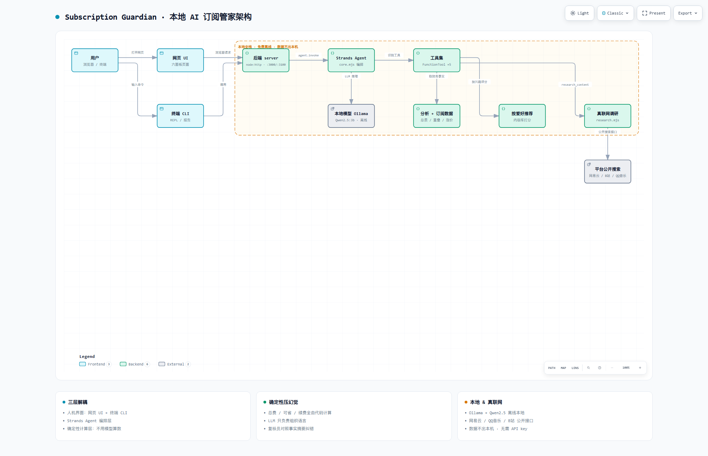

# 🧠 订阅管家 · Subscription Guardian

> **编排你的付费会员，避免空会员浪费，推荐该开哪个。**

一个用 **Strands Agents SDK** 构建的 AI 智能体：替你算清每月的订阅账——揪出**重叠会员**与**涨价**、预告**即将续费**的项目，还会**真联网**查"你喜欢的歌/剧到底在哪个会员能听"，再按你的**爱好与预算**推荐该保留哪些会员。

- 🏆 参赛项目：[**Agents for Humans Hackathon**](https://agentsforhumans.devpost.com/)（Amazon / AWS 主办）
- 🌏 提供 **中文版 + 英文版**两套**完全独立、并行运行**的发行。
- 🆓 完全**本地、免费、离线**（Ollama + Qwen），**无需任何 API key**，数据不出本机。

<p align="center">
  
  <br/><em>点开 <b>architecture/architecture.html</b> 可查看高清可交互架构图</em>
</p>

[](#)
[](#)
[](#)
[](#)
[](#)

---

## ✨ 它能做什么

| 功能 | 说明 |
|---|---|
| 🧮 **算清账** | 总月费/年费、按类别支出、**重叠订阅**（同类留最贵、其余重复白花钱）、**涨价项**、**即将续费**与**可省金额** —— 全部由**代码确定性计算**，100% 准确 |
| 📊 **一键报告** | 生成漂亮的 HTML 仪表盘 + Markdown 报告 |
| 🔎 **真联网调研** | 输入一首歌/一部剧，`research_content` 真去 **网易云 / QQ 音乐 / B站** 公开搜索，告诉你"能不能搜到" |
| 💡 **按爱好推荐** | 还没开任何会员？告诉我你爱听谁、爱看什么 + 预算，推荐你**该开哪些会员** |
| 🤖 **AI 对话** | 网页聊天框直接问，如"模拟取消腾讯视频、芒果TV能省多少" |
| 🔔 **续费提醒** | 列出未来 N 天的续费项，只在需要你决策时才提醒 |
| 🧠 **多智能体** | `--multi`：**分析员起草 → 复核员核对事实**，用复核兜住小模型出错 |

> 💡 设计理念：**"别让 AI 算钱"** —— 所有金额、重叠、节省都由确定性代码算出，LLM 只负责把账讲清楚 + 组织语言。所以它不会编数字。

---

## 🌐 中英文双版（各自独立、并行运行）

同一套引擎做成两套**互相独立、各自运行**的发行：

| | 🇨🇳 中文版 ZH | 🇬🇧 英文版 EN |
|---|---|---|
| 目录 | 根目录本级 | `en/` |
| 网页 UI | http://localhost:3000 | http://localhost:3100 |
| 界面 / 终端 / 数据 | 中文 · 国内示例会员(¥) | English · USD 示例($) |

- **一键同时开两套**：双击 `start-both.bat`（各开一窗、各弹浏览器）。
- 或分别：`node server.mjs`（中文）；`cd en & node server.mjs`（英文）。
- 两套互不干扰、可同时在线、各自维护。

---

## 🚀 快速开始

> 前置：本机装 [Node.js](https://nodejs.org/)（≥18）与 [Ollama](https://ollama.com/)。

```bash
# 1. 启动本地模型服务
ollama serve

# 2.（首次）拉取本地模型
ollama pull qwen2.5:3b

# 3. 安装依赖
npm install

# 4. 打开漂亮网页界面（推荐）
node server.mjs        # 自动开浏览器 http://localhost:3000
```

💡 **懒人启动**：直接双击 `start.bat` → 自动帮你启动 Ollama、检查依赖和模型、弹出模式菜单（我把它做成"默认网页版"）。一键同时开中英双版用 `start-both.bat`。

---

## 🧠 命令行模式（CLI）

```bash
node index.mjs                      # 交互式对话（REPL）：打字问"模拟取消X能省多少"
node index.mjs --report             # 一键报告：生成 report.md + report.html 仪表盘
node index.mjs --multi              # 多智能体：分析员起草 → 复核员纠错定稿
node index.mjs --recommend          # 按爱好推荐该开的会员
node index.mjs --research "七里香"   # 真联网：查这首歌在网易云/QQ音乐/B站能否搜到
node index.mjs --watch 30           # 后台提醒：未来 30 天续费
```

交互模式里可以问：
- 「分析一下我的订阅 / 有什么重叠 / 每月花多少？」
- 「模拟我把腾讯视频、芒果TV取消了能省多少？」
- 「把报告保存下来」 / 「退出」

---

## 🧩 数据从哪来（诚实说明）

- 当前 `data/subscriptions.json` 是**演示样例数据**（自动生成），**不是**你的真实账号信息，程序**不会**读取你任何账号。
- 想接**你的真实订阅**：把 `datasources/user-subscriptions.template.json` 复制命名成 `user-subscriptions.json`，按模板填好即自动优先使用。契约见 `datasources/README.md`。

---

## 🛠 技术栈 & Strands 工具

**技术栈**：Strands Agents SDK · Node.js（纯 JS，无构建）· Ollama + Qwen2.5-3B（本地中文/英文双模型）· 原生 `node:http` 网页 UI。

用到的 **Strands 工具**：

| 工具 | 作用 |
|---|---|
| `get_subscriptions` | 读取订阅清单 |
| `get_financial_facts` | 取已算好的财务分析（重叠 / 涨价 / 续费 / 可省）|
| `simulate_cancel` | 模拟取消后花费与节省（模糊匹配，防止写错名）|
| `save_report` | 保存报告到文件 |
| `research_content` | **真联网**查"某歌/剧在哪个平台能听" |

> ⚠️ `research_content` 走各平台**公开搜索接口**（真联网、免 key）。结果代表"该平台是否收录该内容"的存在性证据；具体版权能否播放以平台当前为准。

**多智能体流水线（`--multi`）**：分析员（带工具取准确数据）起草 → 复核员拿一份简短的【准确事实】逐条核验、纠正数字并删除编造 → 输出定稿。

---

## 📁 仓库结构

```
subscription-guardian/
├── index.mjs · server.mjs · core.mjs      # 入口 / 网页后端 / Strands Agent 装配
├── analyze.mjs · recommend.mjs · research.mjs  # 确定性引擎 / 爱好推荐 / 真联网
├── public/index.html                      # 网页 UI（中文版，六块面板）
├── data/subscriptions.json                # 订阅样例（可替换成你的）
├── datasources/                           # 真实数据接入接口（含模板）
├── en/                                    # 英文版（完全独立的整套）
├── architecture/                          # 架构图（高清PNG + 可交互HTML + 源JSON）
├── docs/                                  # 项目故事/提交清单/YouTube 指南
├── start.bat · start-both.bat             # 一键启动（中文 / 中英双版）
├── LICENSE (MIT) · README.md
```

> 各类文档：`docs/PROJECT_STORY_EN.md`（英文项目故事）、`docs/SUBMISSION.md`（黑客松提交清单）、`docs/YOUTUBE_GUIDE.md`（演示视频指南）。

---

## 🔍 换数据 / 打包你自己的订阅

编辑 `data/subscriptions.json`（或 `user-subscriptions.json`）并按模板填字段：

```
name, category(视频/音乐/云存储/购物/生活…), monthlyPrice, originalPrice,
renewOn(YYYY-MM-DD), autoRenew, note
```

---

## 📄 许可证

[MIT License](LICENSE) — 可自由使用、修改、分发（含商用）。

仓库公开：https://github.com/fuyoupeng2007/subscription-guardian